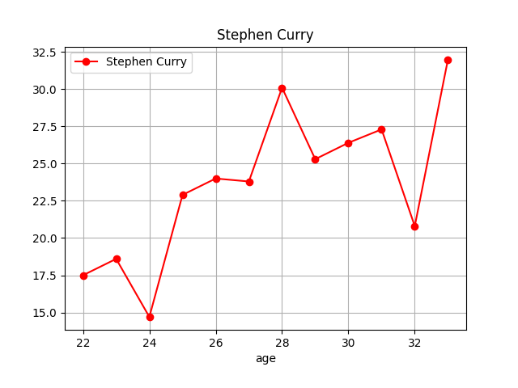
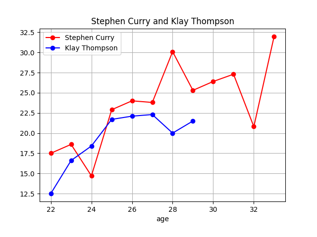
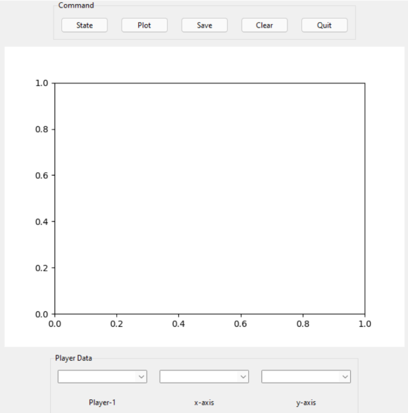
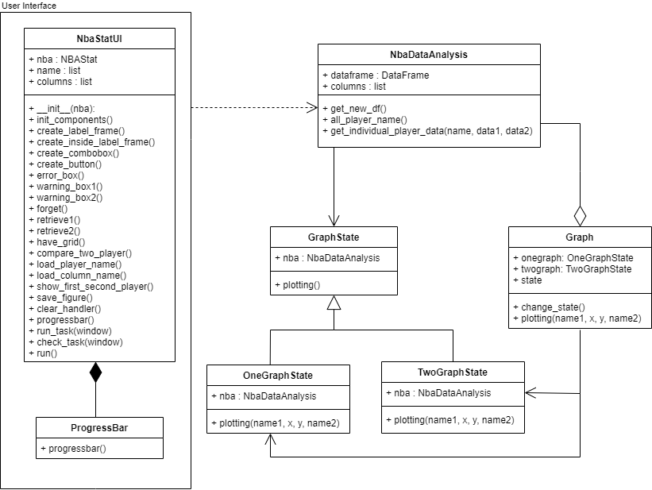

# NBA Data Analysis
This program is a part of the Computer Programming 2 course. It's about NBA Data Analysis.
 
## Description
This application will analyze data of NBA Player in term of graph from `all_season_modified_csv.csv`.

1) User can change state(mode) in onegraph or twograph state by press `State` button.

2) User is able to selected x and y axes then it will display graph of that player and user can save image of that graph as png file.

This is link of my demonstration video [my video]()
 
## Running the Application
The packages that you needed are in the `requirements.txt`. Using `pip -r install requirements.txt` to download packages that you needed. You need to run this program in `main.py`.

Inside `requirements.txt` contain with [pandas](https://pandas.pydata.org/docs/) and [matplotlib](https://matplotlib.org/stable/api/index.html).
 
## Design
The `AppUI` class is the main UI which user will interact with. `NbaDataAnalysis` 
is a class to handle with each player data and associate with `AppUI` and `Graph`.
`Graph` is a superclass for state pattern provide some dafault behavior. 
`OneGraphState` and `TwoGraphState` class are subclass that inherit from `Graph`.
This program contain with two states(modes) which you can change it.

## Design Patterns Used
1) State Design Pattern - The behavior of some objects depends strongly on what state the object is in.

2) Template Method Design Pattern - define an algorithm as a main of operations and leave the details to be implemented by the child classes.

I use template method to create different states for plot graph of that player (depend on state).

 
## Other Information
I learned more about design pattern and more new libraries in this project.

Especially, pandas it's very useful library, it have a many tools for handle many data from csv file.

